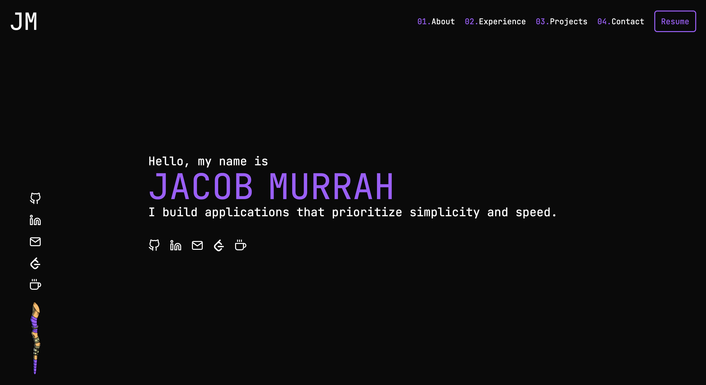

<h1 align="center">
  v1.murrah.dev
</h1>

<p align="center">
  First version of my personal portfolio site.
  <a href="https://v1.murrah.dev/" target="_blank">v1.murrah.dev</a>
</p>

<p align="center">
  
</p>



```bash
http-server ./docs
```